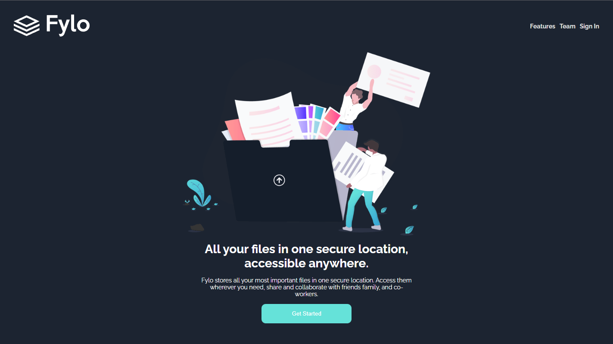

# Fylo
 Fiz esse site para treinar minhas habilidades em Sass.

Welcome! 👋

The challenge
Link para testar o projeto : <a href="https://fylo-project-s.netlify.app/">Fylo</a> - RESPONSIVO ✔️

Nesse Projeto Usei as seguintes tecnologias :

HTML
CSS
Sass (scss)
JavaScript
Git
Github
Node.js

Ideia fornecida por: [Frontend Mentor]
